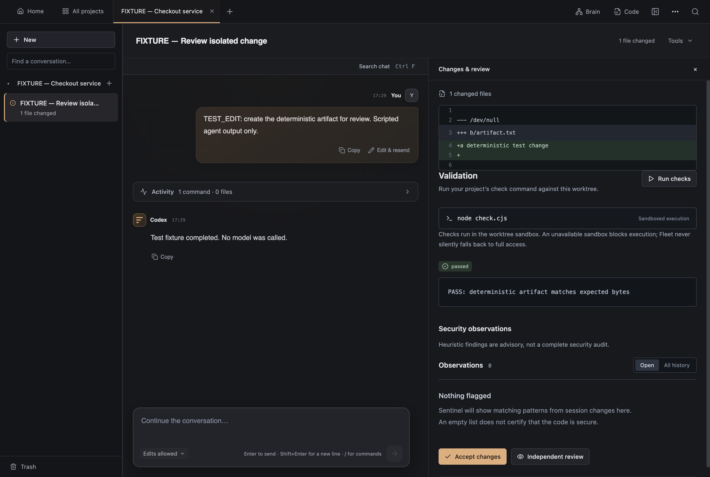
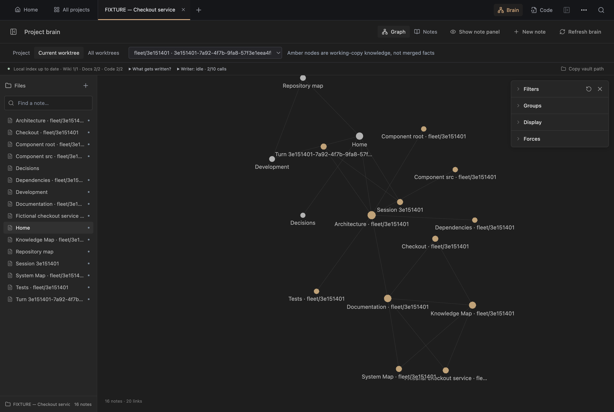

# Codex Fleet

[](https://github.com/benjamin05wilson/codex-fleet/actions/workflows/core.yml) [](https://github.com/benjamin05wilson/codex-fleet/actions/workflows/windows.yml)

A local, **Codex-only** coding-agent workspace for isolated tasks, review evidence and project knowledge. **JavaScript · React · Electron · SQLite · Git worktrees · MCP.** Fleet coordinates execution; Codex supplies generation.

## See it before installing

[**60-second engineering tour**](docs/tour.md) · [Architecture and source trails](docs/architecture.md) · [Fixture run report](docs/evidence/verification/report.json)



*Real Fleet UI and Git worktree; scripted Codex output. The check executes locally through a fixture transport and does not demonstrate the real Codex sandbox. No account or model call is used.*



*Fictional checkout project. Amber nodes are working-copy knowledge, not merged facts. Writer calls shown here are deterministic fixture invocations, not provider usage.*

Three mechanisms to inspect:

- **Independent workers:** reconnect to a surviving worker's journal after daemon detach, with stable identity and one recorded completion. This is not reboot or arbitrary power-loss recovery.
- **Reviewable changes:** tasks use isolated Git worktrees; validation and review evidence remain attached to the task. Store notifications publish after SQLite commit and vanish on rollback.
- **Scoped knowledge and browser tools:** lexical retrieval excludes other worktrees and stale notes; worker capabilities are revalidated. Timed-out browser actions retain queue ownership until their late result arrives.

Approved workflows execute dependencies after explicit approval. Schedules, unattended triggers, provider independence and exactly-once external effects are not implemented. Native browser rendering requires Fleet Desktop.

## Try the fixture without an account

```sh
git clone https://github.com/benjamin05wilson/codex-fleet.git
cd codex-fleet
npm ci --cache .cache/npm
npm run demo:verify
npm run demo:capture
```

Node 24+ and Git are required; capture also needs a graphical macOS/Windows environment and Electron. `demo:verify` is headless. Dependency installation and Electron's first launch require network access; the fixture itself uses only loopback and explicit fixture executables. Capture creates a disposable repository/profile under `.cache`, runs a real local check, saves two product screenshots and removes its owned state. It never connects to the normal Fleet daemon. See [complete setup, cache settings and real Codex path](docs/setup.md).

## Platform scope and checks

macOS-first portfolio project. The badges show **main-branch CI**, while a pull request's checks describe its proposed changes. [Latest checks and dated evidence](docs/platform-status.md) distinguish source tests, desktop smokes and packaging. No published installer/release is claimed; development packages are unsigned and macOS packages are not notarized.

| Platform | Verification gate | Distribution scope |
| --- | --- | --- |
| macOS | Core server/UI checks, production build, fixture verification, Electron brain/large-graph/native-browser smokes | Configured arm64 development app; packaging is a separate action |
| Windows 11 x64 | Native runtime, lifecycle/coverage regressions, UI/build/smokes, NSIS package and branding checks | Configured unsigned x64 installer; generation does not establish installer launch |
| Linux | Core server/UI checks, build and fixture verification | Core portability target; no desktop release |

The product screenshots and run report are actual fixture evidence with their source commit recorded. They demonstrate Fleet mechanisms, not platform-wide compatibility or model performance. Historical counts in [IMPLEMENTATION.md](IMPLEMENTATION.md) are dated checkpoints.

## Read further

[Setup and real tasks](docs/setup.md) · [Feature manual](docs/manual.md) · [Architecture](docs/architecture.md) · [Evidence tour](docs/tour.md) · [Third-party distribution inventory](docs/distribution.md)

Fleet source is available under the [MIT License](LICENSE). `private: true` prevents npm publication. Third-party dependencies and bundled tools retain their own licences and notices; see the [distribution inventory](docs/distribution.md).
