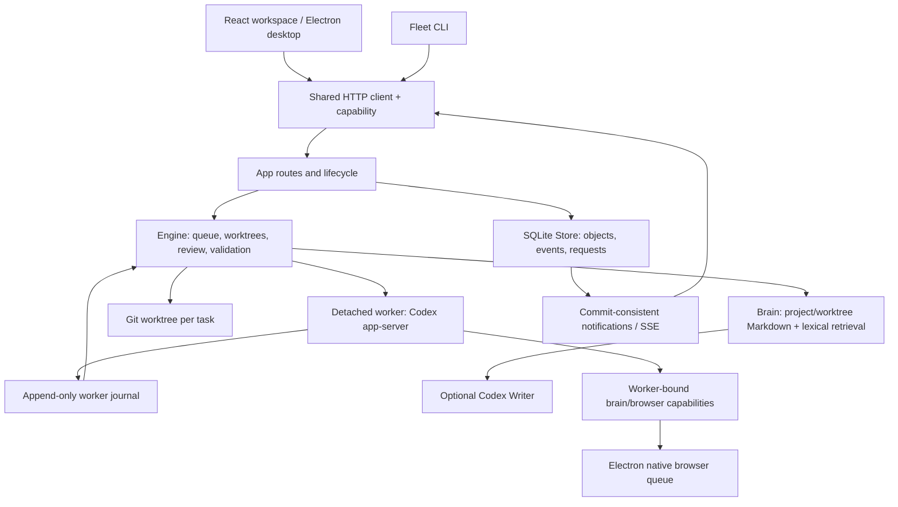

# Architecture and source-reading guide

Fleet is predominantly JavaScript (`.mjs`/`.jsx`) with React, Electron and built-in Node SQLite. `shared/contracts.ts` documents public contracts; there is no full TypeScript application or typecheck guarantee. Codex is the only agent provider.

## Follow one task

Start in [`src/features/session.jsx`](../src/features/session.jsx), then [`shared/client.mjs`](../shared/client.mjs) and [`server/app.mjs`](../server/app.mjs). The app validates local HTTP capabilities and owns the assembled subsystem lifecycle. [`server/engine.mjs`](../server/engine.mjs) creates/queues a run, prepares a separate Git worktree and collects context. [`server/durable.mjs`](../server/durable.mjs) launches or attaches to the worker; [`server/worker.mjs`](../server/worker.mjs) owns the Codex connection. Events return through the worker journal into SQLite and then SSE. The engine records a reviewable result; acceptance remains a separate action. Workflow approval authorizes dependency execution, not schedules or external publishing.

## Three failure/source trails

| Trail | Start here | Assertion to read | What it establishes / limit |
| --- | --- | --- | --- |
| Journal recovery | `launchWorker`, `attachWorker`, `ownsWorker` in [durable.mjs](../server/durable.mjs), then [worker.mjs](../server/worker.mjs) | “worker survives daemon detach” in [focused.test.mjs](../tests/focused.test.mjs) | Detach one engine and attach another; same worker identity, attempt 1, one completion and fixture usage. Surviving-worker reconnection, not arbitrary crash/reboot recovery. |
| Commit notifications | `Store.transaction` and notification buffering in [store.mjs](../server/store.mjs) | [store-transactions.test.mjs](../tests/store-transactions.test.mjs) | Listeners observe committed multi-record state; rollback and failed savepoints emit no phantom changes. Never hold transactions across `await`; SQLite atomicity does not make network/filesystem side effects atomic. |
| Browser cancellation | `agent` and dispatched-command completion in [native-browser-broker.mjs](../server/native-browser-broker.mjs) | “timed out dispatched actions hold serialization” in [native-browser-broker.test.mjs](../tests/native-browser-broker.test.mjs) | Timeout rejects the caller but dispatched work retains queue ownership; late result releases it once, then fresh work proceeds. Manual user input is not serialized with agent actions. |

For the readiness cleanup fix, follow `app.close → auth.close → CodexClient.close` and the child `close` promise in [codex-client.mjs](../server/codex-client.mjs). [api-capability.test.mjs](../tests/api-capability.test.mjs) checks actual stdio closure before removing the child's cwd; Windows CI is still required for platform confirmation.

## Data ownership and trust boundaries

- **Daemon/Store:** one daemon owns its data directory and SQLite lock. Store holds project/run state, durable request identities and event history. Clients do not write SQLite directly.
- **Worker:** owns one Codex app-server connection and journal/identity. Daemon detach preserves workers intentionally; terminal shells and validation commands have different shutdown lifetimes.
- **Worktree:** task edits stay separate from the source branch until accepted. The capture checks both the new artifact in the worktree and unchanged source status. Recovery cannot promise exactly-once arbitrary external writes made by a tool.
- **Brain:** [`brain.mjs`](../server/brain.mjs) indexes Markdown/code/turn receipts; [`brain-broker.mjs`](../server/brain-broker.mjs) binds lookups to worker and scope and rechecks permissions after retrieval. See mid-request revocation in [brain-retrieval.test.mjs](../tests/brain-retrieval.test.mjs). Ranking is lexical, not embedding retrieval. Writer proposals/maintained sections are model output with source checks, not independently verified truth.
- **Browser:** the broker owns agent command ordering and short-lived capabilities. The Electron page is project-scoped and isolated from privileged UI; web-only Fleet cannot render it. These controls do not establish hostile local-user isolation or universal site compatibility.

The large app and engine files remain integration points. Provider expansion, a full language migration and a module rewrite are outside this readiness change.
